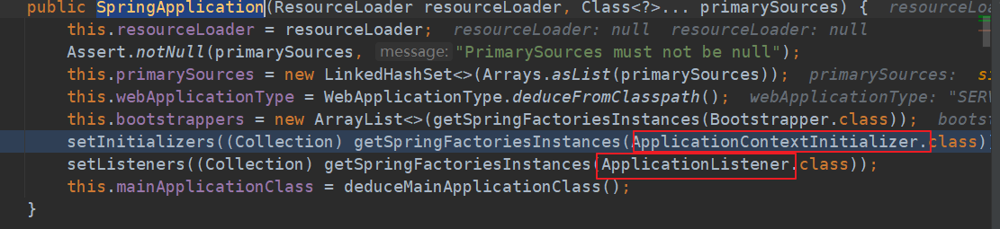
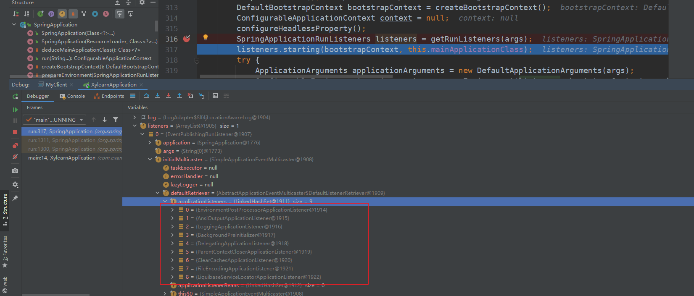

## new SpringApplication()
这个时候会创建应用上下文的Initializer和应用的listener
ApplicationContextInitializer
ApplicationListener

## 走到run方法
### getRunListeners(args) 方法
当走完 getRunListeners(args) 方法的时候
会获得9个applicationListeners,

### listeners.starting();
会把每个listener的starting方法
starting 方法最终会调用 监听器类的onApplicationEvent方法 例如delegatingApplicationListener
但这里还**没有看到@value相关注解的痕迹**

### prepareEnvironment()方法
 listeners.environmentPrepared(); ->doWithListeners()
 ->doWithListeners()->forEach()->又返回到了函数式接口那environmentPrepared()
 ->org.springframework.context.event.SimpleApplicationEventMulticaster.multicastEvent(org.springframework.context.ApplicationEvent)->invokeListener()->doinvok()->listener.onApplicationEvent(event)->onApplicationEnvironmentPreparedEvent
 ->postProcessEnvironment()->org.springframework.boot.context.config.ConfigDataEnvironmentPostProcessor.postProcessEnvironment(org.springframework.core.env.ConfigurableEnvironment, org.springframework.boot.SpringApplication)
 ###
 填充属性的时候会调用到这个方法，又一大堆propertySource,包括后续接入阿波罗也会进来，然后拿相应的注解值
  
  
  AutowiredAnnotationBeanPostProcessor 添加了@autowaire和@value的识别
