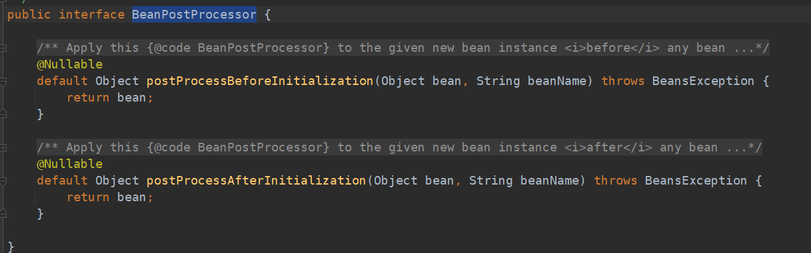
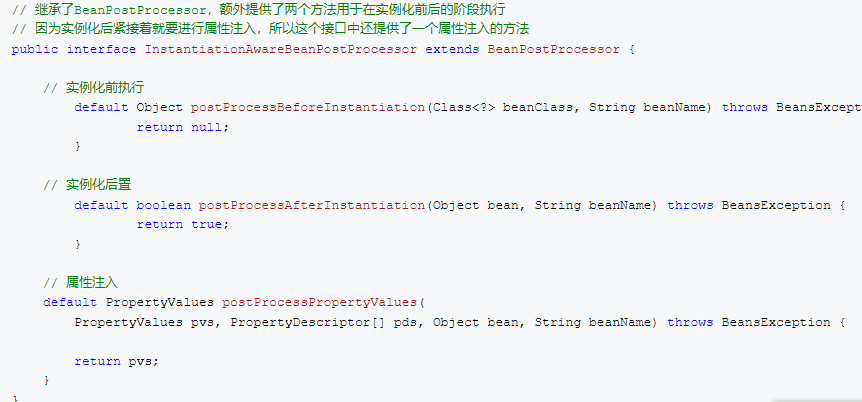

# springd的生命周期
包括.
实例化，可以理解为new一个对象
属性注入，可以理解为调用setter方法完成属性注入
初始化，你可以按照Spring的规则配置一些初始化的方法（例如，@PostConstruct注解）
核心接口 BeanPostprocessor 
    
1单单继承BeanPostprocessor只能完成初始化前后的操作
    

2继承InstantiationAwareBeanPostProcessor 能拓展完成bean的实例化前后操作

org.springframework.beans.factory.support
.DefaultListableBeanFactory#preInstantiateSingletons这个方法创建bean
org.springframework.beans.factory.support.AbstractBeanFactory.doGetBean这个方法获得bean
   
 