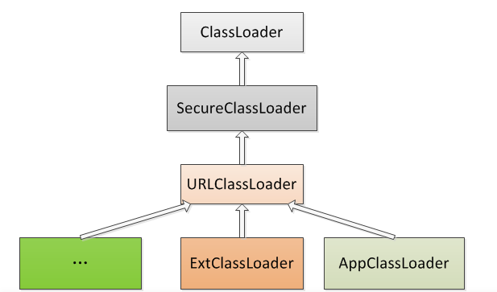

java语言自带三个类加载器

Bootstrap ClassLoader 顶层类加载器 主要核心类库rt.jar,resource.jar
Extention ClassLoader 拓展类加载器 加载lib/ext下的jar包和文件
App ClassLoader 加载当前应用classpath下所有类

sun.misc.Launcher类 是一个java 虚拟机入口应用

总结一下这个类

1初始化了ext 和app
相关关系是

bootstrap classloader 由c++编写，int 相关都由它加载

双亲委派机制

重要方法
sun.misc.Launcher.AppClassLoader.loadClass()
findclass()
如果要自定义一个类加载器，需要定义一个loadclass方法，findclass方法重写
为什么要自定一个类加载器，自定义自己的加载算法，安全性高
自定义步骤
见DefineClassLoadTest

thread 类中 有成员变量context classloader 与线程有关可以获取和设置可以绕过双亲委派

https://blog.csdn.net/briblue/article/details/54973413

